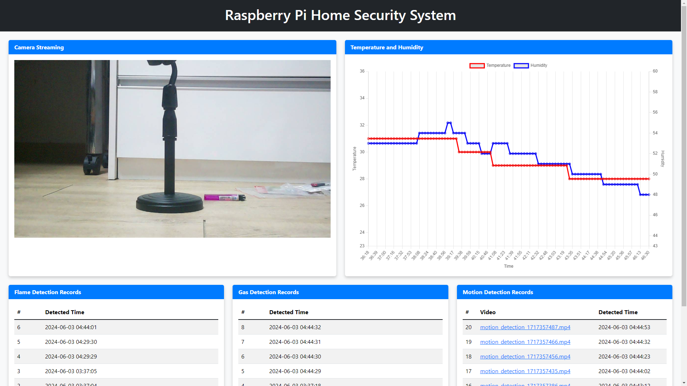

# 🏠 Raspberry Pi Home Security System



A comprehensive home security system utilizing Raspberry Pi, equipped with temperature, humidity, flame, gas, and motion sensors, along with a live camera stream.
The system is built to store detection records in a MySQL database and can send alerts via MQTT.

> This project was developed as a school course project.

## Features

- **Temperature and Humidity Monitoring**: Logs data at regular intervals.
- **Flame Detection**: Detects and logs fire incidents.
- **Gas Detection**: Detects and logs gas leaks.
- **Motion Detection**: Logs motion events and captures video recordings.
- **Relay Control**: Allows remote control of a connected relay.
- **Live Camera Streaming**: Provides a real-time video feed.
- **MQTT Alerts**: Sends alerts for flame, gas, and motion detections.
- **Web Interface**: Displays sensor data and video streams.

## Hardware Requirements

- Raspberry Pi (any model with GPIO support)
- DHT11 Temperature and Humidity Sensor
- Flame Sensor
- Gas Sensor
- Ultrasonic Distance Sensor
- Relay Module
- Camera Module (compatible with Raspberry Pi)
- Breadboard and Jumper Wires

## Software Requirements

- Raspberry Pi OS
- Python 3
- Mosquitto MQTT Broker

## Installation

### Step 1: Install packages

```bash
sudo apt update
sudo apt install ffmpeg mosquitto mosquitto-clients
```

### Step 2: Configure Mosquitto

Modify the Mosquitto configuration file to allow connections from any IP address and enable anonymous access.

```bash
sudo nano /etc/mosquitto/mosquitto.conf
```

Add the following lines to the configuration file:

```conf
bind_address 0.0.0.0
allow_anonymous true
```

Save the file and restart the Mosquitto service:

```bash
sudo systemctl restart mosquitto
```

### Step 3: Set Up Virtual Environment and Install Python Packages

Run the provided `setup.sh` script to create a virtual environment and install the required Python packages.

```bash
chmod +x setup.sh
source setup.sh
```

## Configuration

Create a `.env` file in the project directory and configure the following environment variables.
You can use the provided `.env.example` as a template:

```bash
MQTT_HOST=localhost
MQTT_PORT=1883

MYSQL_DATABASE=pi
MYSQL_USER=root
MYSQL_PASSWORD=raspberry
MYSQL_HOST=localhost
MYSQL_PORT=3306

WEB_SERVER_USER=pi
WEB_SERVER_PASSWORD=raspberry
WEB_SERVER_PORT=8000
```

## Usage

Run the application by executing:

```bash
python3 app.py
```

Access the web interface by navigating to `http://<your_raspberry_pi_ip>:8000` in your browser.
